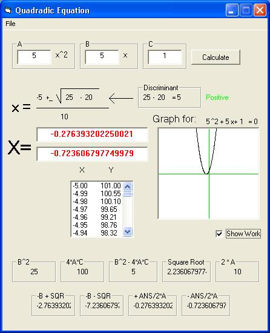



## Brad's Quadratic Equation Solver

### Description

Solves ANY Quadratic Equation. Graphs, Gives (X,Y) Points, and Shows WORK!!
 
### More Info
 

             |
---                |---
**Submitted On**   |2002-05-16 20:40:38
**By**             |[Brad Savon](https://github.com/Planet-Source-Code/PSCIndex/blob/master/ByAuthor/brad-savon.md)
**Level**          |Beginner
**User Rating**    |4.5 (18 globes from 4 users)
**Compatibility**  |VB 5\.0, VB 6\.0
**Category**       |[Math/ Dates](https://github.com/Planet-Source-Code/PSCIndex/blob/master/ByCategory/math-dates__1-37.md)
**World**          |[Visual Basic](https://github.com/Planet-Source-Code/PSCIndex/blob/master/ByWorld/visual-basic.md)
**Archive File**   |[Brad's\_Qua840435162002\.zip](https://github.com/Planet-Source-Code/brad-savon-brad-s-quadratic-equation-solver__1-34835/archive/master.zip)

